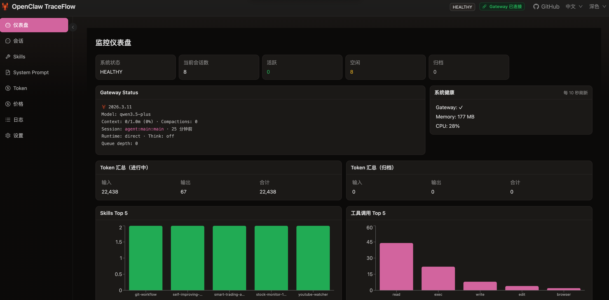
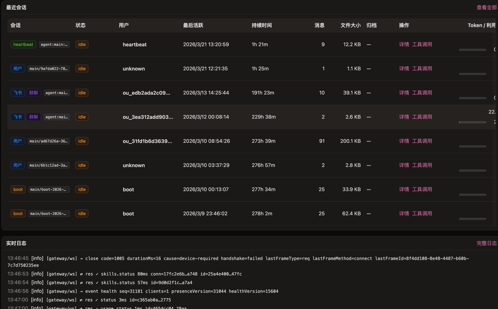
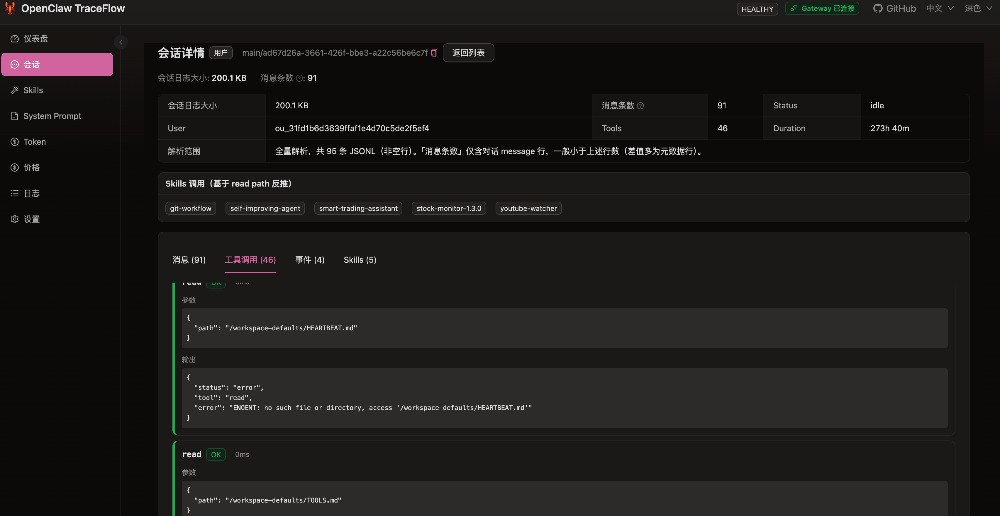
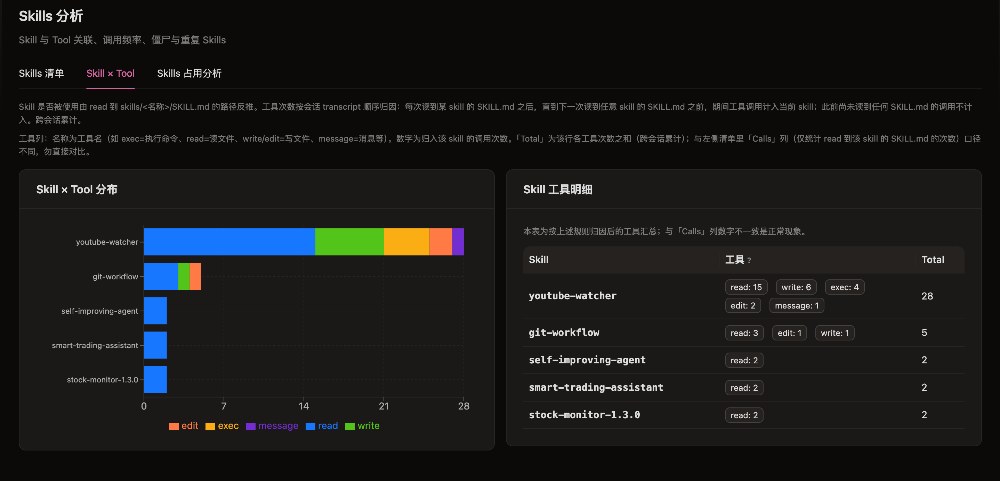
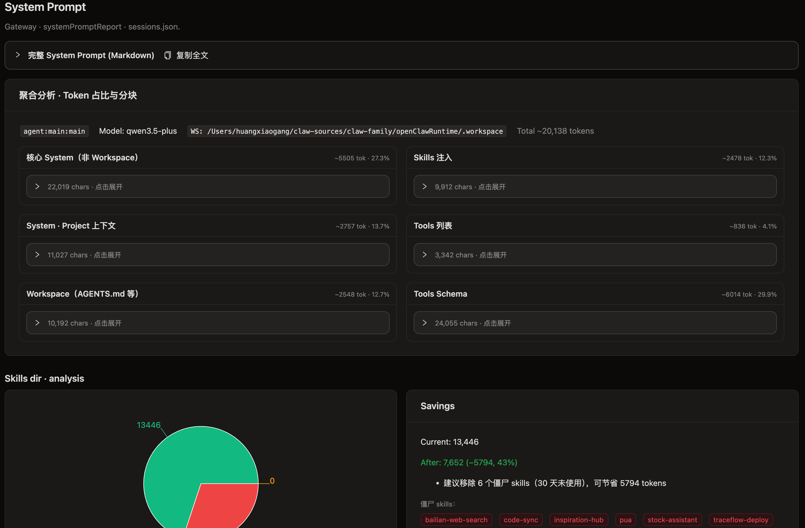
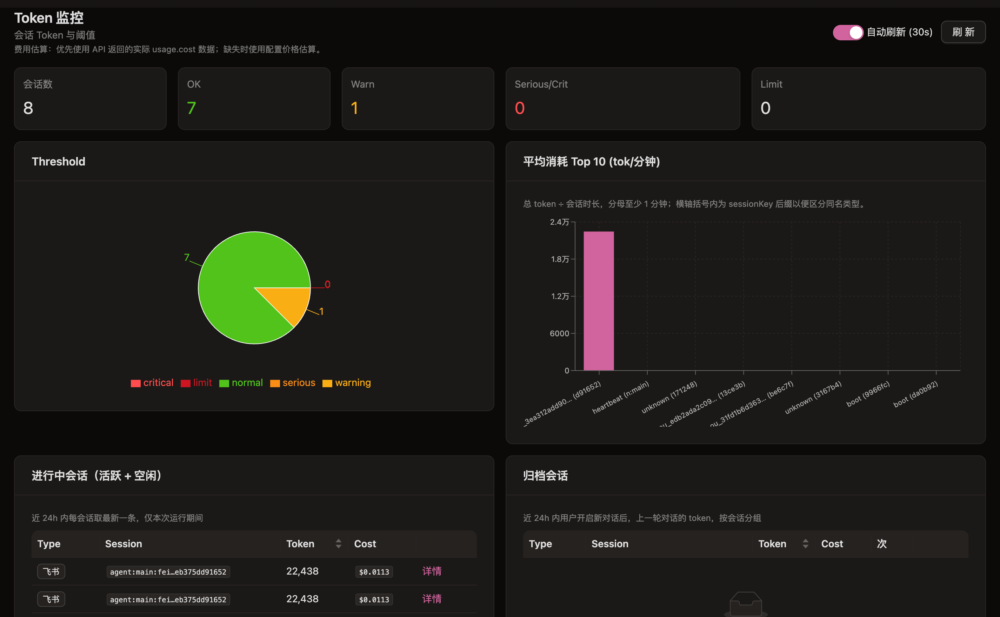
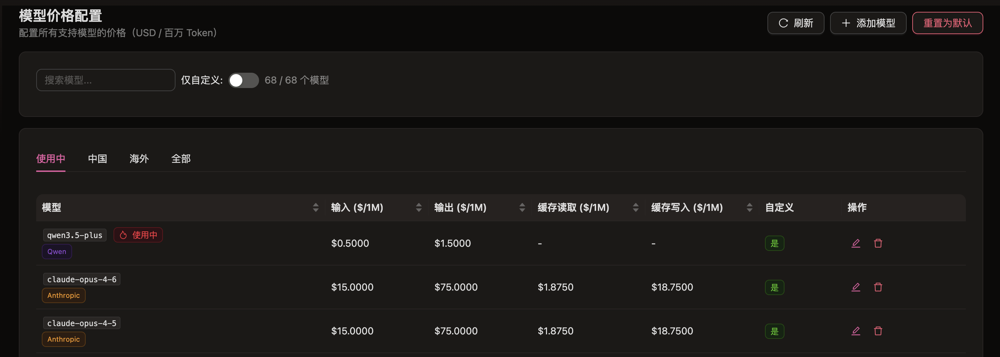

# OpenClaw TraceFlow

[](/LICENSE)
[](https://nodejs.org/)
[](https://pnpm.io/)
[](https://nestjs.com/)
[](https://react.dev/)
[](https://vite.dev/)

面向 **[OpenClaw](https://docs.openclaw.ai) Agent** 的**可观测性** Web 应用：会话、Skill、Token 用量与告警、延迟（P50/P95/P99）、System Prompt 分析、模型计价与实时日志。独立 NestJS + React 服务，界面支持**中文 / English**。

**语言：** [English](README.md) · 简体中文（本页）

---

## 为什么选择 TraceFlow（对比 OpenClaw 默认管理后台）

| 能力 | OpenClaw 默认管理后台 | TraceFlow |
|------|-----------------------|-----------|
| 与 Gateway 同包分发 | 是 | 否（独立应用） |
| Skill 调用追踪（read 路径反推） | — | 有 |
| 用户维度 Skill 统计 | — | 有 |
| Token 阈值与排行 | 基础 | 增强 |
| System Prompt 分析 | — | 有 |
| 延迟 P50/P95/P99 | — | 有 |
| Gateway 连接方式 | 长驻 WS | 长驻 WS（复用 `status`、`usage`、`logs.tail`、`skills.status` 等） |
| 部署方式 | 随 Gateway | 独立 PM2、独立端口 |
| 界面语言 | 以单语为主 | 中英双语 |
| 自动化友好性 | 基础 | JSON HTTP API + 日志 WebSocket 推流 |

---

## 界面截图

### 仪表盘 / 会话





### Skills / Prompt / Token / 价格






---

## 环境要求

| 项 | 说明 |
|----|------|
| Node.js | `>= 20.11.0`（推荐 20 LTS） |
| pnpm | `>= 9.0.0` |
| PM2 | 生产环境推荐（`deploy:pm2`） |

---

## 快速开始

在克隆本仓库后，进入 **`openclaw-traceflow`** 目录执行：

```bash
pnpm run deploy:pm2
```

将依次执行 **`pnpm install`**、构建前后端，并在 PM2 中启动或重载进程名 **`openclaw-traceflow`**。浏览器访问 **`http://localhost:3001`**（或你配置的 `HOST` / `PORT`）。

请确保 Gateway 可被 **`OPENCLAW_GATEWAY_URL`** 访问（默认 `http://localhost:18789`）。若 Gateway 需要鉴权，在界面 **设置** 中填写 Token / Password。

---

## 技术栈

- 后端：NestJS + TypeScript
- 前端：React + Vite + Ant Design
- 实时日志：Socket.IO

---

## 概述

TraceFlow 是运行在 **OpenClaw Gateway** 之外的**独立服务**（默认连接 `http://localhost:18789`）。它不替代 Gateway，也不替代 OpenClaw 自带的**默认管理后台**，而是为**运维与排障**提供专用仪表盘，可部署在**另一端口或另一台机器**（默认监听 **`http://0.0.0.0:3001`**）。

---

## 配置（先零配置）

TraceFlow 默认即可开箱即用。大多数本地环境下，不设置任何环境变量，直接执行 `pnpm run deploy:pm2` 后访问 `http://localhost:3001` 即可。

### 常见场景（通常只需要这一项）

| 变量 | 何时需要设置 | 默认 |
|------|--------------|------|
| `OPENCLAW_GATEWAY_URL` | Gateway 不在本机默认地址/端口可达时 | `http://localhost:18789` |

如果 Gateway 需要鉴权，优先在界面 **设置** 页填写 Token / Password。

### 可选覆盖（高级）

| 变量 | 作用 | 默认 |
|------|------|------|
| `HOST` | 监听地址 | `0.0.0.0` |
| `PORT` | 端口 | `3001` |
| `DATA_DIR` | 本地数据目录（如 metrics DB） | `./data` |
| `OPENCLAW_GATEWAY_TOKEN` / `OPENCLAW_GATEWAY_PASSWORD` | Gateway 鉴权（WS/RPC） | 未设置 |
| `OPENCLAW_STATE_DIR` / `OPENCLAW_WORKSPACE_DIR` | 路径覆盖 | 自动解析 |
| `OPENCLAW_LOG_PATH` | Gateway 不可用时的本地日志回退 | 未设置 |
| `OPENCLAW_ACCESS_MODE` | 保护 `/api/setup/*`（`local-only` · `token` · `none`） | `none` |
| `OPENCLAW_RUNTIME_ACCESS_TOKEN` | `OPENCLAW_ACCESS_MODE=token` 时使用的 Bearer Token | 未设置 |

更细说明见 **`config/README.md`** 与可选 `config/openclaw.runtime.json`。

**计价：** Token 费用估算使用内置默认价表；可用 `config/model-pricing.json` 覆盖（参考 `config/model-pricing.example.json`）。

---

## 界面路由

| 路径 | 说明 |
|------|------|
| `/`、`/dashboard` | 总览：Gateway 健康、Token、延迟、工具等 |
| `/sessions`、`/sessions/:id` | 会话列表与详情 |
| `/skills` | Skill 使用统计 |
| `/system-prompt` | System Prompt 分析 |
| `/tokens` | Token 监控与告警 |
| `/pricing` | 模型价格 |
| `/logs` | 实时日志（Socket.IO） |
| `/settings` | Gateway 地址、路径、访问控制 |

### 会话与「参与者」列（读数说明）

- **一行会话**对应 OpenClaw 里的一条**对话线程**（一个 `sessionId` / 一份 transcript）；**群聊里多人**通常仍共享**同一条**会话，不是每人一行。
- **`sessionKey`** 表达**路由与形态**（如飞书、群 / 频道 / 私聊等），与「列里显示谁」不是同一维度。
- **`agent:<agentId>:main`** 在 OpenClaw 中表示 **`dmScope` 为 `main` 时私聊折叠到的默认主会话桶**；界面类型为 **「主会话」**，**不要**把它与「心跳任务专用会话」划等号——定时 heartbeat 也可能写入同一条 transcript，**仅凭 key 无法判断是否为 heartbeat。**
- **参与者（列表）：** TraceFlow 会扫描 transcript JSONL，对发送者去重（含 `Sender` / `Conversation info` 元数据块、`senderLabel`、`message.sender` 等）。若存在**多名**不同真人发送者，列中展示为 **`首位标识 (+N)`**，其中 **`N`** 为**除首位外**的其余人数（不是总人数）。
- **参与者（详情）：** 多人时主行展示首位与 **+N**，点击 **+N** 可在浮层中查看与列表同源的去重列表。群成员可能多于 transcript 中出现的发送者，**仅展示 transcript 中解析到的身份。**
- **会话详情 · 消息：** 单栏列表；每条消息默认**一行**摘要，**点击行**展开全文，**箭头**收起（避免展开后选中文本时误触收起）。
- 若仍为 `unknown`，多为索引未写入或 transcript 首条无法推断，属数据源限制，详见会话详情内说明。

---

## 性能与容量

TraceFlow 面向**单机、中等规模**会话量。会话量**极大**时，CPU 与磁盘 I/O 可能升高（例如工具/Skill Top 列表需扫描会话数据）。边界与改进计划见仓库根目录 **`ROADMAP.md`**。

---

## 安全

仅 **`/api/setup/*`**（首次配置、测连、保存）受 **`OPENCLAW_ACCESS_MODE`** 约束；其余读取类接口**未做统一 Bearer 校验**。**请勿在未做网络隔离或反向代理鉴权的情况下将 TraceFlow 暴露到公网。**

| 模式 | 行为 |
|------|------|
| `local-only` | 仅本机 IP 可修改配置 |
| `token` | 修改配置需 `Authorization: Bearer <OPENCLAW_RUNTIME_ACCESS_TOKEN>` |
| `none` | 不校验（仅可信网络） |

---

## HTTP API（节选）

便于脚本与监控；完整路由以 `src/**/*controller.ts` 为准。

| 路径 | 方法 | 说明 |
|------|------|------|
| `/api/health` | GET | 健康与 Gateway 连接摘要 |
| `/api/status` | GET | Gateway `status` / `usage` JSON |
| **`/api/dashboard/overview`** | **GET** | 仪表盘聚合；可选 `?timeRangeMs=` |
| `/api/sessions` | GET | 会话列表 |
| `/api/sessions/:id` | GET | 会话详情 |
| `/api/sessions/:id/kill` | POST | 终止会话 |
| `/api/metrics/*` | GET | 延迟、tools/skills、token 汇总等 |
| `/api/logs` | GET | 最近日志 |
| `/api/setup/*` | GET/POST | 设置相关（受访问模式保护） |

---

## WebSocket（日志）

Socket.IO 命名空间 **`logs`**：`logs:subscribe`、`logs:unsubscribe`、服务端推送 `logs:new`（含 `timestamp`、`level`、`content`）。

---

## 常见故障

| 现象 | 排查 |
|------|------|
| 连不上 Gateway | 检查 `OPENCLAW_GATEWAY_URL`、防火墙；在设置中填写 Token |
| 设置里「测试连接」报 **`missing scope: operator.read`** | TraceFlow 使用无设备身份的 backend 连接时，Gateway 会清空 scopes；路径探测已避免调用 `skills.status`。若仍见旧报错，请更新到已修复版本。仪表盘概览使用 **`health` RPC**（豁免 scope）。实现说明见 monorepo 根目录 **`AGENTS.md`**。 |
| 日志为空 | 优先使用 Gateway `logs.tail`；无 operator scope 时可能拿不到 Gateway 日志，会回退为空；可配置 `OPENCLAW_LOG_PATH` |
| Token 指标为 0 | 确认会话是否产生用量；核对 `/api/metrics/token-summary` 与 `/api/sessions/token-usage` |

---

## Roadmap

见 **`ROADMAP.md`**。

---

## 参与贡献

欢迎 Issue / PR（Bug、功能、文档、UI、测试）。

---

## 许可证

MIT © [slashhuang](https://github.com/slashhuang)

---

### 作者链接

- [X](https://x.com/brucelee_1991)  
- [小红书](https://www.xiaohongshu.com/user/profile/5845481182ec395656dfb393)  
- [知乎](https://www.zhihu.com/people/huang-da-xian-14-14)  
