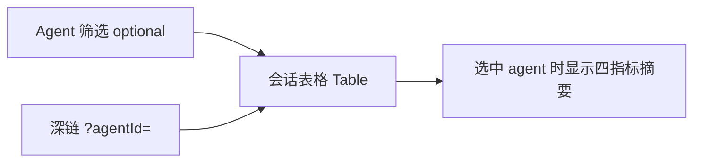

# OpenClaw Traceflow 重构 PRD

本文档定义 **OpenClaw Traceflow**（以下简称 Traceflow）的产品定位、功能范围与数据契约，作为「全新 Traceflow 流程」的设计依据。实现与迭代时以本文与 OpenClaw 官方文档（会话、工作区、system prompt）为准。

---

## 1. 产品定位与边界

### 1.1 定位

Traceflow **不替代、也不实现** OpenClaw **Control UI** 的职责（例如完整的网关控制台、远程会话实时操控等）。Traceflow 专注于：

- **用户侧可观测数据**：以 **workspace** 与 **states**（及派生磁盘结构）为事实来源，呈现与分析；
- **OpenClaw 表现的度量**：在能力范围内对运行表现、会话与资源使用等做可读的度量与汇总（具体指标集可在实现阶段与现有 metrics 模块对齐）；
- **与 Wave 定制 skills 的协同**：重点配合为 OpenClaw 定制的 skills，尤其是 **self-improvement** 与 **agent-audit**，使「审计 / 改进」工作流与本地数据视图一致。

### 1.2 非目标（明确不做）

- 不复制 Control UI 的全套网关管理能力；
- **不要求** Gateway 在线或连接成功才能使用 Traceflow：只要本机 **states / workspace** 等路径可解析且磁盘可读，核心功能即应可用（见 **§2.2**）。

---

## 2. 核心设计原则

### 2.1 磁盘为会话与工作区视图的主数据源

在 **onBoarding 已配置 states / workspace 路径** 的前提下：

- **会话元数据**：以各 agent 目录下 `sessions/sessions.json` 为嗅探与列表依据（与 OpenClaw 一致：`$OPENCLAW_STATE_DIR/agents/<agentId>/sessions/sessions.json`）；
- **转写文件**：`sessions/` 下 `*.jsonl` 等与官方 [Session Management](../../openclaw/docs/reference/session-management-compaction.md) 描述一致；
- **工作区与记忆**：从用户配置的 **workspace** 根目录读取树与文件内容（bootstrap 文件列表见 [System Prompt / Workspace bootstrap](../../openclaw/docs/concepts/system-prompt.md)）；
- **states 树**：从配置的 **states 根目录** 读取（配置、凭据、agents 等目录结构遵循 OpenClaw 惯例）。

若用户通过自定义 `OPENCLAW_STATE_DIR` / 配置路径导致实际目录与默认值不同，以 **onBoarding / 设置中用户显式路径** 为准。

### 2.2 Gateway 弱依赖（无 Gateway 仍应「完整可用」）

**原则**：Traceflow 的 **默认工作模式** 是 **本机磁盘**：会话、工作区、states、反思列表、按 agent 的会话概览（`/sessions`）等，均以用户配置的目录为事实来源。**Gateway 不是启动与浏览的前置条件**。

**当 Gateway 未配置、连接失败或不可达时**，以下 **以磁盘为主** 的能力仍须 **可用**，不得整页阻断为「请先连接 Gateway」（与下文 **Gateway 专属模块** 的「按需展示 / 未连接则去设置」分流不同）：

| 能力域 | 无 Gateway 时的预期 |
|--------|---------------------|
| 会话路由 `/sessions`（表格 + Agent 筛选，见 **§3.2**） | 基于磁盘 `sessions.json` / `*.jsonl`，正常展示 |
| 会话列表 / 会话详情 | 同上 |
| 工作区与记忆、States 浏览 | 仅磁盘 |
| Agent/Harness 中 bootstrap 预览与编辑 | 仅磁盘 + Traceflow 内 override |
| 设置（路径、bootstrap override 等） | 正常保存与生效 |

**依赖 Gateway 的增强能力**（**按需开启**；不得阻塞上述磁盘核心路径）：

- **产品形态**：凡 **必须经 Gateway** 才能提供价值的能力（实时日志尾、与 Gateway 进程绑定的健康/指标、经 Gateway 下发的实时事件等），在 UI 上视为 **可选模块**——**连得上 Gateway 才展示**对应入口或完整内容；**连不上** 时 **不** 用大面积空态/占位页占主导，而是 **引导用户跳转至「设置」页** 完成或修正 Gateway（URL、鉴权等）配置，连接成功后再回到原能力。
- **路由与入口**：可单独为「Gateway 在线能力」设入口（如顶栏、侧边栏小节）；未连接时点击该类入口 → **跳转设置页**（并可选锚定到 Gateway 区块），而非停留在无意义的空白详情页。
- **与磁盘能力的关系**：会话列表、工作区、States、bootstrap 等 **不** 因未连接 Gateway 而跳转设置；仅 **明确标注为 Gateway 依赖** 的交互采用「按需展示 + 未连接则去设置」策略。

| 能力域（示例） | 未连接 Gateway 时的预期 |
|----------------|-------------------------|
| 顶栏/健康中与 Gateway 绑定的实时指标 | 不展示完整数据；相关入口点击 → **设置** |
| 依赖 Gateway 的日志尾、status 合并字段 | 同上，或整段模块隐藏直至连上 |
| 未来「经 Gateway 下发的实时事件」 | 按需展示；未连接 → **设置** |

**OnBoarding / 设置**：Gateway（URL、鉴权）为 **可选步骤或可选配置**；用户 **跳过** 或 **从未连接成功** 时，Traceflow **仍须** 进入可用状态；**仅** Gateway 增强模块按上表处理。

**实现约束（对工程）**：路径解析须 **优先** 使用 Traceflow 已持久化的 `openclawStateDir` / `openclawWorkspaceDir` / `openclawConfigPath` 与环境变量；**不得** 将「仅能通过 Gateway 才能解析 stateDir」作为唯一路径来源。若曾用 Gateway 辅助解析，在 Gateway 断开时应 **回退** 到显式路径与本地启发式（与 `openclaw-paths.resolver` 行为一致）。

---

## 3. 功能规划

### 3.1 OnBoarding（首次引导）

**必要路径**（用户必须完成或确认）：

1. **States 目录**：即 OpenClaw 状态根目录（默认：`~/.openclaw`，对应环境变量语义 `$OPENCLAW_STATE_DIR`）。
2. **Workspace 目录**：即 agent 工作区根（默认与 OpenClaw 一致，如 `~/.openclaw/workspace`，对应配置项 `agents.defaults.workspace` 的常见值）。

**默认值**：上述输入框的 **预设占位** 使用 OpenClaw 官方默认值（与文档/FAQ 一致），降低首次使用成本。

**Override**：

- 支持用户填写 **自定义路径**（自定义 state 位置、多环境隔离目录等），Traceflow **只信任用户给定的 states 根路径**，其下仍按 OpenClaw 约定解析 `openclaw.json`、`agents/<agentId>/sessions/` 等相对结构。
- **主配置文件位置**（对照 OpenClaw [`paths.ts`](../../openclaw/src/config/paths.ts)）：默认 **`$OPENCLAW_STATE_DIR/openclaw.json`**；若用户通过环境变量 **`OPENCLAW_CONFIG_PATH`** 指向其他文件，OpenClaw 会以该文件为准——Traceflow 可选支持「单独指定 openclaw.json 路径」或在文档中提示用户将 states 目录与真实配置位置对齐，避免编辑/预览与网关运行不一致。

**可选步骤：Gateway 连接（非阻断）**：

- 提供连接与校验；用户 **可跳过** 或 **稍后**在设置中配置。
- **不要求** 先连接成功再进入应用：完成 **States + Workspace**（及可选 config 路径）并保存后，即可依赖磁盘使用 Traceflow；Gateway 仅增强在线能力，见 **§2.2**。

#### 3.1.1 OnBoarding 配置存储方案

**存储位置**：用户 onboarding 配置信息存储在 **`~/.openclawTraceFlow`** 目录，与 OpenClaw 的 `~/.openclaw` 命名风格一致，避免冲突。

**目录结构**：

```
~/.openclawTraceFlow/
├── config/
│   ├── onboarding.json              # 用户 onboarding 配置（核心）
│   ├── bootstrap-overrides.json     # bootstrap 文件路径覆盖映射
│   └── preferences.json             # 用户偏好设置
├── cache/
│   ├── paths-cache.json             # 路径解析缓存
│   └── gateway-cache.json           # Gateway 连接信息缓存
├── logs/
│   └── onboarding.log               # onboarding 过程日志
└── backups/
    └── onboarding.json.backup.{timestamp}  # 配置备份（保留最近 10 个）
```

**核心配置文件：`onboarding.json`**

```typescript
{
  "version": "1.0.0",                // 配置版本，用于未来迁移
  "completedAt": "2026-04-03T...",   // ISO 8601 timestamp
  
  "openclaw": {
    "stateDir": "~/.openclaw",       // 必填：OpenClaw 状态目录（OPENCLAW_STATE_DIR）
    "workspaceDir": "~/.openclaw/workspace",  // 必填：工作区目录
    "configPath": "~/.openclaw/openclaw.json", // 可选：主配置文件路径（OPENCLAW_CONFIG_PATH）
    
    // 路径来源标记（便于故障排查）
    "pathSources": {
      "stateDir": "explicit|env|gateway|inferred|fallback",
      "workspaceDir": "explicit|gateway|config-file|cli|sessions-json|none",
      "configPath": "explicit|env|cli|gateway|none"
    },
    
    "cliBinary": "/usr/local/bin/openclaw",  // 可选：CLI 路径
    "profile": "default"                      // 可选：OPENCLAW_PROFILE
  },
  
  "gateway": {
    "enabled": true,                  // Gateway 是否启用（可选，非阻断）
    "url": "http://localhost:18789",  // Gateway URL
    "token": "[ENCRYPTED]",           // 加密存储（AES-256-CBC）
    "password": "[ENCRYPTED]",        // 加密存储
    "lastConnected": "2026-04-03T...", // 最后连接时间
    "connectionStatus": "connected|disconnected|error",
    "connectionError": "..."          // 连接错误信息（如有）
  },
  
  "traceflow": {
    "host": "0.0.0.0",                // TraceFlow 服务 host
    "port": 3001,                     // TraceFlow 服务 port
    "accessMode": "local-only|token|none",  // 访问模式
    "accessToken": "[ENCRYPTED]",     // 访问令牌（加密存储）
    "dataDir": "./data"               // 数据目录
  },
  
  "onboardingSteps": {
    "pathConfiguration": true,        // 路径配置完成
    "gatewaySetup": false,            // Gateway 设置完成（可选）
    "accessConfiguration": true       // 访问控制配置完成
  }
}
```

**Bootstrap 覆盖配置：`bootstrap-overrides.json`**

```typescript
{
  "files": {
    // 逻辑文件名 → 绝对路径映射（与 §3.3 一致）
    "AGENTS.md": "/custom/path/to/AGENTS.md",
    "SOUL.md": "/another/path/SOUL.md",
    "TOOLS.md": "/workspace/custom/TOOLS.md",
    "MEMORY.md": "/workspace/.agents/MEMORY.md"
  },
  "updatedAt": "2026-04-03T...",      // ISO 8601 timestamp
  "source": "onboarding|user-edit|import"
}
```

**用户偏好：`preferences.json`**

```typescript
{
  "ui": {
    "theme": "light|dark|auto",
    "language": "zh-CN|en-US",
    "dashboardRefreshInterval": 10    // 秒
  },
  "features": {
    "autoConnectGateway": true,
    "enableWorkspaceWrite": false,    // 对应 OPENCLAW_WORKSPACE_WRITE
    "tokenEstimateBytesDivisor": 4    // Token 估算除数
  },
  "paths": {
    "openclawLogPath": "~/.openclaw/logs/openclaw.log"  // OpenClaw 日志路径
  }
}
```

**安全性约束**：

- **敏感信息加密**：`gateway.token`、`gateway.password`、`traceflow.accessToken` 使用 **AES-256-CBC** 加密存储；
- **文件权限**：所有配置文件权限设为 **`0o600`**（仅所有者可读写）；
- **加密密钥**：存储在 `~/.openclawTraceFlow/.encryption.key`，权限 **`0o600`**，进程启动时自动生成（如不存在）。

**配置优先级**（从高到低）：

1. **`~/.openclawTraceFlow/config/onboarding.json`**（用户显式配置，最高优先级）
2. **环境变量**（如 `OPENCLAW_STATE_DIR`、`OPENCLAW_GATEWAY_URL` 等）
3. **`config/openclaw.runtime.json`**（Traceflow 工作目录内配置文件）
4. **默认值**（见 `config.service.ts`）

**与现有配置系统集成**：

- **双向同步**：`ConfigService` 启动时从 `~/.openclawTraceFlow` 加载配置；用户通过 **`POST /api/setup/complete-onboarding`** 保存配置时，同时写入 `~/.openclawTraceFlow` 与 `config/openclaw.runtime.json`；
- **迁移支持**：提供 `ConfigMigrationService` 从旧配置（`openclaw.runtime.json`）迁移到新位置；
- **版本升级**：配置文件包含 `version` 字段，便于未来版本自动迁移字段结构。

**实现入口**：

- **存储服务**：`src/onboarding/onboarding-storage.service.ts`
- **迁移服务**：`src/onboarding/config-migration.service.ts`
- **API 端点**：`POST /api/setup/complete-onboarding`（完成 onboarding 并持久化配置）

**验收要点**：

- 用户完成 onboarding 后，`~/.openclawTraceFlow/config/onboarding.json` 文件存在且包含正确配置；
- 敏感信息已加密（文件中不包含明文 token/password）；
- 下次启动时自动加载 `~/.openclawTraceFlow` 配置，无需重新 onboarding；
- 配置文件损坏时，能回退到 `backups/` 目录中的最近备份；
- 修改配置时自动备份旧配置（保留最近 10 个）。

---

### 3.2 会话路由与按 Agent 概览

#### 3.2.1 按 Agent 的指标来源（与 `/sessions` 表格配套）

- **数据来源**：onBoarding 配置的 **states 目录** 下 `agents/<agentId>/sessions/` 的磁盘数据（以 `sessions.json` + 目录内文件为嗅探基础）。
- **用途**：为 **`/sessions`** 提供 **Agent 筛选器** 的候选项，并在用户 **选定某一 `agentId`** 时，在表格上方展示该 agent 的 **四指标**（总数 / 活跃 / 空闲 / 归档），与列表数据同源、避免与表格语义冲突。
- **首屏**：`/sessions` **首屏即会话表格**（见 **§3.2.3**、**§3.2.4**），**不**再将「仅卡片、无表格」作为必经着陆形态；按 agent 分块的 **卡片式概览** 不作为必选模块，若产品上仍需可作为可选入口或并入其他页。
- **四指标口径**：与 OpenClaw `SessionEntry` 及目录扫描结果一致；**归档**与 Traceflow 既有「归档」统计对齐（实现阶段与 metrics、`*.jsonl.reset.*` 等现有逻辑及 [Session Management](../../openclaw/docs/reference/session-management-compaction.md) 一致即可）。
- **明确不做**：**不**强制「先卡片、后表格」的两段式导航；全局跨 agent 的独立「最近会话」面板仍非必选（表格本身可在未筛选 agent 时展示多 agent 行）。

#### 3.2.2 会话列表：术语与场景

会话列表中会出现多种文件与场景（与 OpenClaw 磁盘行为一致），需在 UI/文档中统一 **名词术语**，与官方概念对齐，避免与「会话」口语混用：

| 术语 | 含义（Traceflow 展示用） |
|------|--------------------------|
| **sessionKey** | 路由键（哪个对话桶），如 main、群组、cron 等 |
| **sessionId** | 当前转写对应的 id，通常对应某条 `*.jsonl` |
| **sessions.json** | 每 agent 的会话元数据存储（sessionKey → SessionEntry） |
| **Transcript** | `<sessionId>.jsonl` 转写文件 |
| **Reset** | 用户或策略触发的「新 sessionId」切换；同 key 下可能多代转写 |
| **Reset 归档** | 磁盘上形如 `*.reset.<timestamp>` 的归档转写（维护与保留策略见 OpenClaw `session.maintenance`） |
| **Topic 变体** | 如 Telegram 等场景的 `topic` 后缀文件（`*-topic-<threadId>.jsonl`） |

列表应能区分「当前活跃会话条目」与「历史/归档/变体文件名」，具体分组与排序规则在实现阶段按 `sessions.json` 与目录扫描结果定义。

#### 3.2.3 会话路由：表格优先与 Agent 维度

与 **§3.2.1** 使用 **同一套按 agent 指标**（总数 / 活跃 / 空闲 / 归档），供「选中某 agent」时的表头摘要与 API 对齐，避免与表格语义矛盾。

- **入口**：`/sessions` **默认即展示会话表格**；工具栏提供 **Agent 筛选**（留空或未带查询参数 = **全部 agent**，列表 API **不传** `agentId` 或等价语义）。
- **全部 agent 模式**：表格 **包含 `agentId` 列**（或等价展示），行可来自多个 agent；**排序、筛选、分页** 仍以服务端全量过滤结果为口径（见 **§3.2.4**）。
- **单 agent 模式**：用户从筛选器选定 agent 或深链 **`/sessions?agentId=<id>`** 时，列表仅包含该 agent 下的会话，**可隐藏** `agentId` 列以省宽；表格 **上方** 宜 **复述** 该 agent 的四指标（与 **§3.2.1** 一致）。
- **表格化列表、筛选项与表头行为** 的完整约定见 **§3.2.4**。



#### 3.2.4 会话列表：表格布局、筛选项与表头交互

**布局**

- **`/sessions` 始终** 以 **表格（Table）** 为主体；**无** `agentId` 时展示 **跨 agent** 会话行（带 **Agent** 列）；**有** `agentId` 时表格仅含该 agent 行，Agent 列可省略。
- 列用 **固定表头 + 横向滚动** 适应窄屏；加载态使用表格级 loading，避免整页空白。

**筛选项（分层，避免概念重叠）**

| 层级 | 作用 | 约定 |
|------|------|------|
| **Agent** | 限定「哪一只 agent 的磁盘会话空间」 | 工具栏 **下拉 / 可清空**；清空 = 全部 agent。**URL** `agentId` 与筛选 **同步**（可书签、可分享）；**非**「清除后回到无表格着陆页」。 |
| **会话集合/状态桶** | 与后端列表 API 的粗粒度一致 | 例如：**全部 / 活跃 / 空闲 / 归档 / 索引滞后** 等（与现有 `filter` 枚举对齐）；放在表格 **上方工具区**（如分段器），变更时 **重置分页到第一页**。 |
| **列级筛选（表头）** | 在当前数据子集（全部或单 agent + 当前桶）内做 **细分** | 适用于 **离散维度**：如行内 **运行状态**、**会话类型标签**、**聊天形态**（若已派生）。**服务端**过滤以保证分页正确（与已实现 `GET /api/sessions` 扩展参数一致）。 |
| **关键词** | 按 `sessionKey` / 参与者等 **子串** 收窄 | 工具栏 **搜索框**；**服务端**参数（如 `q`），与排序、列筛选、分页同一管线。 |

**表头：排序与筛选的职责划分**

- **排序**：凡 **可比** 的列（时间、时长、数值、字典序字符串等），表头支持 **点击切换排序**：首次点击设定 **主排序列** 与默认方向（建议时间与用量类默认 **降序**，名称类默认 **升序**）；再次点击在同一列上 **反转** 升/降序。当前主排序列在表头有 **视觉指示**（如箭头）。**同一时刻** 仅一种主排序键（多 product 键排序可作为后续增强）。
- **筛选**：对适合 **枚举/有限集合** 的列，表头提供 **筛选入口**（图标或下拉），筛选条件与顶栏 **会话集合桶** 组合时：**先** 按 API 桶取数（或服务端等价过滤），**再** 应用列筛选（优先 **服务端** 过滤以保证分页正确；若暂时仅前端过滤，须在实现说明中限定为「当前页」或「全量拉取模式下」，避免用户误以为全库筛选）。
- **不参与排序/筛选的列**：如纯 **操作**（详情、工具链路等），表头无排序筛选。

**与分页、性能**

- 列表 API 已分页时：**排序** 若依赖全量数据，必须由 **服务端** 按 `sortBy` / `sortOrder` 与 `filter` 一并返回；列筛选同理。客户端仅对 **当前响应内** 的少量行做二次过滤时，须在 UI 文案或开发备注中标明 **范围**，避免指标误解。

**验收要点（产品）**

- 打开 `/sessions` **即见表格**；未选 agent 时可见多 agent 数据；选中 agent 后，**表格上方四指标摘要** 与 **§3.2.1** 口径 **一致**。
- 变更 `agentId`、顶栏会话桶、列筛选、关键词或排序后，表格数据与分页 **一致更新**。
- 表头排序、表头筛选在窄屏下仍 **可操作**（横向滚动表头跟随）。

---

### 3.3 Agent 与 Harness

- **范围**：本区块**不负责**会话列表、`sessions.json` 嗅探等——这些归 **§3.2 会话路由与按 Agent 概览**；Agent 与 Harness **除下文所述外，整体保持现有 Traceflow 行为与布局**。
- **核心能力（本区块重点）**：对 **Agent 侧 bootstrap 上下文文件**（OpenClaw 源码中类型为 `WorkspaceBootstrapFile`：字段 **`name`** + 解析后的磁盘 **`path`**，见 [`workspace.ts`](../../openclaw/src/agents/workspace.ts)）提供 **预览与编辑**。默认文件名集合与文档一致：`AGENTS.md`、`SOUL.md`、`TOOLS.md`、`IDENTITY.md`、`USER.md`、`HEARTBEAT.md`、`BOOTSTRAP.md`，以及 **`MEMORY.md` 或 `memory.md` 二选一**（[`DEFAULT_MEMORY_FILENAME` / `DEFAULT_MEMORY_ALT_FILENAME`](../../openclaw/src/agents/workspace.ts)）。
- **「Context」在 OpenClaw 源码中的含义**：运行时在 system prompt 里组装的 **`contextFiles`**（`EmbeddedContextFile[]`，含 `path` + `content`）由 **`resolveBootstrapContextForRun` → `buildBootstrapContextFiles`** 从上述 bootstrap 文件读出（见 [`bootstrap-files.ts`](../../openclaw/src/agents/bootstrap-files.ts)），**并非** `openclaw.json` 顶层的单独键名；PRD 下文用 **「bootstrap 文件路径」** 指用户可编辑的实体文件。
- **路径从何而来（与 Traceflow override 对齐）**：
  1. **默认**：各文件位于 **`agents.defaults.workspace`**（或 **`agents.list[]` 中对应条目的 `workspace`**）目录下，与 OpenClaw 配置 [`types.agents.ts`](../../openclaw/src/config/types.agents.ts) / [`zod-schema.agent-runtime.ts`](../../openclaw/src/config/zod-schema.agent-runtime.ts) 中 **`workspace`** 字段一致。
  2. **Profile**：若使用 **`OPENCLAW_PROFILE`**（非 `default`），OpenClaw 默认工作区可为 `~/.openclaw/workspace-<profile>`（[`resolveDefaultAgentWorkspaceDir`](../../openclaw/src/agents/workspace.ts)）——Traceflow 默认值或说明中应提及与 profile 一致。
  3. **额外路径模式**：内置 hook **`bootstrap-extra-files`** 可通过配置 **`paths` / `patterns` / `files`** 数组，在 workspace 下追加匹配到的 bootstrap 文件（见 [`handler.ts`](../../openclaw/src/hooks/bundled/bootstrap-extra-files/handler.ts)）；basename 仍须为受支持的 bootstrap 文件名。
  4. **运行时替换路径**：内部 hook **`agent:bootstrap`** 可改写 `bootstrapFiles[].path`（见 [`bootstrap-hooks.ts`](../../openclaw/src/agents/bootstrap-hooks.ts)）。若用户依赖 hook 将某逻辑文件指到自定义绝对路径，Traceflow **OnBoarding / 设置** 中的 **per-file 路径 override** 用于在同一台机器上对齐编辑目标，避免仅依赖自动推断。
- **Traceflow 侧 override**：在设置中维护 **逻辑文件名（如 `AGENTS.md`）→ 绝对路径** 的映射（可多键）；加载/保存时 **override 优先**，否则回退到「当前解析到的 workspace 根 + 默认相对路径」。
- **其余**：Harness 与 Agent 页的其余模块（与现有产品一致的部分）**基本不变**，不因「磁盘化会话」而改写本区块职责。

---

### 3.4 工作区与记忆

- **交互与结构**：保持现有 Traceflow 能力（树、预览、记忆相关入口等）。
- **数据逻辑**：**仅自磁盘读取**——根路径为 onBoarding/设置中的 **workspace**；不引入与 Control UI 重复的远程写路径，除非用户显式连接 Gateway 且产品后续扩展。

---

### 3.5 States

- **交互与结构**：保持现有 states 浏览方式。
- **数据逻辑**：**仅自磁盘读取**——根路径为配置的 **states** 目录。

---

### 3.6 反思列表（Reflections）

- **交互与结构**：不变。
- **数据逻辑**：**从磁盘读取**（具体文件路径与现有 Traceflow `reflections` 实现保持一致，迁移时统一走 `resolveOpenClawPaths` 或等价解析）。

---

### 3.7 设置

- **与 OnBoarding 对应**：同一套配置项的后台与持久化，支持用户在设置中修改：
  - **states** 根目录（对应 **`OPENCLAW_STATE_DIR`**，内含默认 **`openclaw.json`**，见 [`resolveStateDir` / `resolveCanonicalConfigPath`](../../openclaw/src/config/paths.ts)）；
  - **workspace** 根目录（与 **`agents.defaults.workspace`** 语义对齐；若 Traceflow 从 `openclaw.json` 读取到不同值，需定义 **以用户设置为准还是以配置文件为准**，建议产品层以 **用户显式设置** 覆盖自动读取）；
  - **可选**：**`OPENCLAW_CONFIG_PATH`** 或单独「主配置文件路径」，供高级用户与 OpenClaw 一致；
  - **bootstrap 文件路径 override**（逻辑名 → 绝对路径，与 §3.3 一致，可多项）。
- **Gateway**：**可选**配置；与 **§2.2** 一致——未连接不影响 states/workspace 驱动的核心功能。产品侧应提供清晰的 **Gateway 配置区块**（URL、鉴权、连接测试等），供 **按需开启** 的在线能力在未连接时 **跳转至此**（可深链到该区块）。
- **持久化**：所有设置变更须 **同步保存** 到 **`~/.openclawTraceFlow/config/onboarding.json`**（详见 **§3.1.1**）与 `config/openclaw.runtime.json`，确保配置在重启后生效；敏感信息（token/password）加密存储。
- **体验**：修改路径后应触发数据重新索引或缓存失效，避免展示旧路径下的会话与工作区；提供「重置为默认值」与「从备份恢复」选项。

---

## 4. 与定制 Skills 的协同

- **agent-audit**：Traceflow 展示的路径与文件树应与 audit skill 扫描范围可对照（同一 workspace/states 根路径），便于用户从会话概览或列表跳到审计产物或配置。
- **self-improvement**：会话与度量视图为「改进」提供上下文；具体触发方式由 skill 定义，Traceflow 不强制实现 skill 内部逻辑。

---

## 5. 参考与依赖文档（OpenClaw）

- 状态目录与 `sessions.json` 位置：[FAQ](../../openclaw/docs/help/faq.md)（Where does OpenClaw store its data）
- 会话存储、转写、reset 归档：[Session Management & Compaction](../../openclaw/docs/reference/session-management-compaction.md)
- Bootstrap 注入与 context 文件：[System Prompt](../../openclaw/docs/concepts/system-prompt.md)
- 工作区概念：[Agent workspace](../../openclaw/docs/concepts/agent-workspace.md)

---

## 6. 文档维护

- 产品范围或数据契约变更时，同步更新本文 **§2**（尤其 **§2.2** 与 Gateway 边界）、**§3**（尤其 **§3.2** `/sessions` 表格优先与 Agent 筛选、**§3.2.4** 筛选项）、**§7** 与术语表。
- 实现阶段若引入新指标或新页面，在附录中补充「与本文条款的映射关系」即可，避免重复全文。

---

## 7. 附录：OpenClaw 路径与配置对照（执行用）

以下与 **openclaw 源码** 对齐，供 Traceflow 解析与联调时减少歧义。

### 7.1 环境变量（节选）

| 变量 | 作用（OpenClaw） |
|------|-------------------|
| `OPENCLAW_STATE_DIR` | 状态根目录，默认 `~/.openclaw`（亦可能迁移自 `~/.clawdbot`），见 `resolveStateDir` |
| `OPENCLAW_CONFIG_PATH` | 主配置文件路径覆盖；默认 `$STATE_DIR/openclaw.json` |
| `OPENCLAW_PROFILE` | 非 `default` 时默认 workspace 可为 `workspace-<profile>` |
| `OPENCLAW_HOME` | 参与 home 解析（与路径展开有关） |

主配置文件名：**`openclaw.json`**；遗留别名：**`clawdbot.json`**（候选解析见 `paths.ts`）。

### 7.2 与会话磁盘布局（与 §3.2 一致）

- `agents/<agentId>/sessions/sessions.json`
- `agents/<agentId>/sessions/<sessionId>.jsonl`（及文档所述 topic / reset 等变体）

**UI 口径**：`/sessions` 在选中某 agent 时展示的四指标，以及列表行数据，均须能派生自上述路径下的磁盘数据（及与之一致的扫描、metrics 逻辑），与 **§3.2** 约定一致。

类型定义入口：OpenClaw `src/config/sessions.ts`（PRD 不逐字段复制，UI 与 `SessionEntry` 对齐即可）。

### 7.3 Workspace 与 bootstrap 相关配置键（节选）

| 配置路径 | 含义 |
|----------|------|
| `agents.defaults.workspace` | 默认 agent 工作区目录 |
| `agents.list[].workspace` | 按 agent 覆盖工作区 |
| `agents.defaults.bootstrapMaxChars` | 单文件注入最大字符 |
| `agents.defaults.bootstrapTotalMaxChars` | 注入总字符上限 |
| `agents.defaults.bootstrapPromptTruncationWarning` | `off` / `once` / `always` |

**说明**：额外 bootstrap 路径常通过 **hooks**（如 **`bootstrap-extra-files`** 的 `paths`/`patterns`/`files`）加载，而非单独顶层 `contextFiles` 配置键。

### 7.4 源码索引（便于实现时跳转）

| 主题 | 文件 |
|------|------|
| State / config 路径 | [`openclaw/src/config/paths.ts`](../../openclaw/src/config/paths.ts) |
| Agent 默认项类型 | [`openclaw/src/config/types.agent-defaults.ts`](../../openclaw/src/config/types.agent-defaults.ts) |
| `agents.list` 条目 | [`openclaw/src/config/types.agents.ts`](../../openclaw/src/config/types.agents.ts) |
| Bootstrap 文件加载与合法文件名 | [`openclaw/src/agents/workspace.ts`](../../openclaw/src/agents/workspace.ts) |
| 组装运行时 contextFiles | [`openclaw/src/agents/bootstrap-files.ts`](../../openclaw/src/agents/bootstrap-files.ts) |
| bootstrap hook 覆盖 | [`openclaw/src/agents/bootstrap-hooks.ts`](../../openclaw/src/agents/bootstrap-hooks.ts) |
| 额外 bootstrap 文件 hook | [`openclaw/src/hooks/bundled/bootstrap-extra-files/handler.ts`](../../openclaw/src/hooks/bundled/bootstrap-extra-files/handler.ts) |

### 7.5 OnBoarding 配置存储实现指南

本节补充 **§3.1.1** 的实现细节。

#### 7.5.1 加密实现

**加密算法**：AES-256-CBC

**密钥生成与存储**：
```typescript
// 密钥路径：~/.openclawTraceFlow/.encryption.key
// 权限：0o600（仅所有者读写）
const keyPath = path.join(os.homedir(), '.openclawTraceFlow', '.encryption.key');

if (!fs.existsSync(keyPath)) {
  const key = crypto.randomBytes(32); // 256 bits
  fs.writeFileSync(keyPath, key, { mode: 0o600 });
}
```

**加密格式**：`{iv_hex}:{encrypted_hex}`（IV 与密文用 `:` 分隔）

**需加密字段**：
- `gateway.token`
- `gateway.password`
- `traceflow.accessToken`

#### 7.5.2 配置加载顺序（ConfigService）

```typescript
async loadConfig(): Promise<Config> {
  // 1. 默认配置（硬编码）
  const defaultConfig = { host: '0.0.0.0', port: 3001, ... };
  
  // 2. 从 config/openclaw.runtime.json 加载（如存在）
  const fileConfig = this.loadFromRuntimeFile();
  
  // 3. 从环境变量覆盖
  const envConfig = this.loadFromEnv();
  
  // 4. 从 ~/.openclawTraceFlow/config/onboarding.json 加载（最高优先级）
  const onboardingConfig = await this.onboardingStorage.loadOnboardingConfig();
  
  // 5. 合并（后者覆盖前者）
  return { ...defaultConfig, ...fileConfig, ...envConfig, ...onboardingConfig };
}
```

#### 7.5.3 配置保存流程（Setup Controller）

```typescript
@Post('complete-onboarding')
async completeOnboarding(@Body() body: SetupRequest) {
  // 1. 验证输入
  this.validateOnboardingInput(body);
  
  // 2. 解析路径（调用 openclaw-paths.resolver）
  const paths = await resolveOpenClawPaths({
    explicitStateDir: body.openclawStateDir,
    explicitWorkspaceDir: body.openclawWorkspaceDir,
    explicitConfigPath: body.openclawConfigPath,
    gatewayHttpUrl: body.openclawGatewayUrl,
    gatewayToken: body.openclawGatewayToken,
    gatewayPassword: body.openclawGatewayPassword,
  });
  
  // 3. 测试 Gateway 连接（可选）
  let gatewayStatus = { connected: false };
  if (body.openclawGatewayUrl) {
    gatewayStatus = await this.testGatewayConnection(body);
  }
  
  // 4. 构造配置对象
  const onboardingConfig: OnboardingConfig = {
    version: '1.0.0',
    completedAt: new Date().toISOString(),
    openclaw: {
      stateDir: paths.stateDir || body.openclawStateDir || '',
      workspaceDir: paths.workspaceDir || body.openclawWorkspaceDir || '',
      configPath: paths.configPath || body.openclawConfigPath,
      pathSources: paths.source,
    },
    gateway: {
      enabled: !!body.openclawGatewayUrl,
      url: body.openclawGatewayUrl,
      token: body.openclawGatewayToken,
      password: body.openclawGatewayPassword,
      lastConnected: gatewayStatus.connected ? new Date().toISOString() : undefined,
      connectionStatus: gatewayStatus.connected ? 'connected' : 'disconnected',
    },
    traceflow: {
      host: body.host || '0.0.0.0',
      port: body.port || 3001,
      accessMode: body.accessMode || 'none',
      accessToken: body.accessToken,
      dataDir: './data',
    },
    onboardingSteps: {
      pathConfiguration: true,
      gatewaySetup: gatewayStatus.connected,
      accessConfiguration: !!body.accessMode,
    },
  };
  
  // 5. 保存到 ~/.openclawTraceFlow（加密敏感信息）
  await this.onboardingStorage.saveOnboardingConfig(onboardingConfig);
  
  // 6. 保存到 config/openclaw.runtime.json（兼容）
  this.configService.updateConfig({ ...onboardingConfig });
  
  // 7. 记录日志
  await this.onboardingStorage.logOnboardingEvent('onboarding_completed', {
    stateDir: paths.stateDir,
    workspaceDir: paths.workspaceDir,
    gatewayEnabled: gatewayStatus.connected,
  });
  
  return { success: true, message: 'Onboarding completed' };
}
```

#### 7.5.4 备份策略

- **触发时机**：每次保存配置前自动备份旧配置；
- **备份位置**：`~/.openclawTraceFlow/backups/`；
- **命名格式**：`{filename}.backup.{ISO8601-timestamp}`（例：`onboarding.json.backup.2026-04-03T10-30-45-123Z`）；
- **保留策略**：保留最近 **10 个**备份，自动删除更早的备份；
- **恢复方式**：提供 `GET /api/setup/backups` 列出可用备份，`POST /api/setup/restore-backup` 恢复指定备份。

#### 7.5.5 错误处理

| 场景 | 处理策略 |
|------|----------|
| `~/.openclawTraceFlow` 创建失败 | 降级到 `config/openclaw.runtime.json`，记录警告日志 |
| 加密密钥损坏 | 提示用户「配置已损坏，建议从备份恢复或重新 onboarding」 |
| 配置文件 JSON 解析失败 | 尝试从最近备份恢复；若无可用备份，触发重新 onboarding |
| Gateway 连接失败 | **不阻断** onboarding 完成，设置 `gateway.connectionStatus = 'error'` |

#### 7.5.6 迁移脚本

提供 CLI 工具 `pnpm run migrate-config`，支持：

```bash
# 从旧配置迁移到 ~/.openclawTraceFlow
pnpm run migrate-config --from=config/openclaw.runtime.json

# 导出配置到文件（便于备份/迁移）
pnpm run migrate-config --export=my-backup.json

# 从文件导入配置
pnpm run migrate-config --import=my-backup.json
```

**迁移逻辑**：
1. 读取 `config/openclaw.runtime.json`；
2. 转换为 `OnboardingConfig` 格式；
3. 敏感字段加密；
4. 保存到 `~/.openclawTraceFlow/config/onboarding.json`；
5. 备份原文件为 `openclaw.runtime.json.migrated.{timestamp}`。

#### 7.5.7 实现文件清单

| 文件路径 | 说明 |
|----------|------|
| `src/onboarding/onboarding-storage.service.ts` | 配置存储服务（加密、读写、备份） |
| `src/onboarding/config-migration.service.ts` | 配置迁移服务（版本升级、格式转换） |
| `src/onboarding/onboarding.module.ts` | OnBoarding 模块定义 |
| `src/config/config.service.ts` | 现有配置服务（需集成 OnboardingStorageService） |
| `src/setup/setup.controller.ts` | Setup API（添加 `POST /api/setup/complete-onboarding`） |
| `scripts/migrate-config.ts` | 配置迁移 CLI 脚本 |

#### 7.5.8 API 端点扩展

| 端点 | 方法 | 说明 |
|------|------|------|
| `/api/setup/complete-onboarding` | POST | 完成 onboarding 并持久化到 `~/.openclawTraceFlow` |
| `/api/setup/backups` | GET | 列出可用的配置备份 |
| `/api/setup/restore-backup` | POST | 从指定备份恢复配置 |
| `/api/setup/export-config` | GET | 导出当前配置为 JSON（敏感信息已加密） |
| `/api/setup/import-config` | POST | 从 JSON 导入配置 |

---
