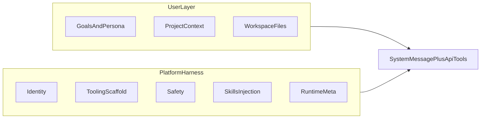

# Agent Harness 可见与 System Prompt 分层

本文档描述 **OpenClaw TraceFlow** 面向「有价值 AI Agent」的产品方向：**Harness 可见（harness visible）**、以及如何把 OpenClaw 已定义的 **system prompt 结构**与**工作区 Markdown** 摊开给人看。

**项目定位（开源、面向开发者）：** TraceFlow 是**开源**可观测仪表盘（独立部署，代码与协议公开），面向在本机或团队环境运行 OpenClaw 的**每一位开发者/运维**。设计意图是：任何人 clone / 部署后，**用 TraceFlow 扫一眼**就能判断 **「我的 harness 做得怎么样」**——工作区引导文件是否齐、与 OpenClaw **Structure** / **Project Context** 是否对得上、Skills 与 Tooling 是否健康、Token 是否被 bootstrap 或重复 skill 拖垮等，**不依赖**闭源控制台，也**不必**靠口头转述配置。

**信息架构的唯一锚点**是 OpenClaw 官方文档中的 **章节标题与文件名**（见第 4 节）；本仓库只读对照路径为 **`external-refs/openclaw/docs/concepts/system-prompt.md`**、**`external-refs/openclaw/docs/concepts/agent-workspace.md`**（与上游 [System Prompt](https://docs.openclaw.ai/concepts/system-prompt)、[Agent workspace](https://docs.openclaw.ai/concepts/agent-workspace) 对应）。TraceFlow **不发明**新的「OpenClaw 工件」名称；中文界面用语仅作导航标签，须能指回下列英文专有名词或具体 `*.md` 文件名。

第 3 节的「双层模型」用于说明 TraceFlow **代码**（`system-prompt-probe.ts` / `system-prompt-rebuild.ts`）如何映射到上述原文，**不以 TraceFlow 实现替代 OpenClaw 规范**。

---

## 1. 北极星：从「能跑」到「有价值的 Agent」

OpenClaw 把大模型接进真实世界；TraceFlow 作为**开源**侧车，让开发者**自主**把这套接法**看清楚、比得准、改得动**：同一套界面既可服务个人推敲 harness，也可让团队共享**可复现**的观测口径（会话、Token、System Prompt 探针、Skills 等），便于 code review 式地讨论「harness 哪里过重、哪里缺失」。

**「有价值」在此处的操作性定义：**

| 维度 | 含义 |
|------|------|
| **目标（outcomes）** | Agent 被期望解决什么问题、交付什么结果（可对外说清楚）。 |
| **人设（behavior）** | 语气、边界、拒绝策略、协作方式相对稳定、可预期。 |
| **工具面（tools / skills）** | 模型可调用的能力与组织策略清晰；Skill 与裸 Tool 的分工可被读懂。 |
| **可审计上下文** | Token、system 侧拼装、注入文件来源可追溯，减少「黑盒 prompt」。 |

**产品倒推方式：** 先按 OpenClaw 文档固定 **Structure / Project Context / Workspace file map** 做信息骨架（第 4 节），再收敛 TraceFlow 各页标题与 ℹ——让读者一眼对照「官方怎么说、我磁盘上有什么文件、运行时拼进了哪一段」。

---

## 2. 核心概念：Harness 可见（Harness Visible）

### 2.1 什么是 Harness

**Harness** 指把模型接入 OpenClaw **运行时**时的那一层**组合物**，包括但不限于：

- 进入 **system 角色消息**（或等价载体）的指令与结构块；
- 工作区规则与**注入到 system 上下文**的文件片段；
- **API 请求体**中与 prompt 配套的 **tools 定义**（如 function calling 的 schema）；
- **Skills** 的清单、描述与按需 `read` 路径（通常以结构化块出现在 system 文本中）。

它**不是**单指某一段用户手写的 Markdown，而是「平台 + 用户 + 运行时」拼在一起后，模型与其调用栈实际依赖的那套**约束与能力面**。

### 2.2 「可见」意味着什么

**可见**指：一位**不必读代码**的协作者打开 TraceFlow，能在约 **30 秒内**回答：

1. 这个 Agent **主要为谁、解决什么问题**（业务目标可陈述）。
2. **哪些部分由用户定义、可调教**；**哪些由 OpenClaw 固定注入**（平台基座）。
3. **工具与 Skill** 各自如何进入模型上下文（含「schema 不在 prompt 文本里」等易错点）。

与「只展示一整段 System Prompt Markdown」相比，Harness 可见要求：

- **分层标签**（用户层 / 平台层 / 工具与 API 侧）；
- **默认突出用户意图区**，平台噪音可折叠；
- 与现状差距诚实写进路线图（见第 5 节）与可行性（见第 6 节），不在文案中过度承诺。

---

## 3. System Prompt 的两层模型（与实现对齐）

真实发给模型的 system 侧内容，在产品上拆为两层，并与 TraceFlow 解析逻辑对齐。

### 3.1 对照表

| 产品称呼 | 含义 | TraceFlow / OpenClaw 对应 |
|----------|------|---------------------------|
| **平台层 / Harness 基座** | OpenClaw 文档 **Structure** 中列出的固定区块（Tooling、Safety、Skills 等，见 §4.2）；用户通常不逐字编辑 | Gateway 侧 **`systemPromptReport`** 的字符/Token 占比经 `buildBreakdownFromReport` 等与仪表盘对齐。TraceFlow 离线重建顺序见 `system-prompt-rebuild.ts`，**段落命名以 OpenClaw 原文为准**，实现仅力求结构可解析。 |
| **用户层 / 工作区注入上下文** | OpenClaw 将引导文件 **trim 后追加到「Project Context」**（见 §4.4）；另含工作区内 **Skills** 的 **`SKILL.md`**（按需 `read`，见 §4.5） | 具体文件名 **仅**使用 OpenClaw 所列：**`AGENTS.md`、`SOUL.md`、`TOOLS.md`、`IDENTITY.md`、`USER.md`、`HEARTBEAT.md`、`BOOTSTRAP.md`（仅全新工作区）、`MEMORY.md` 或回退 `memory.md`**——**不得**改写为小写 `identity.md` 等非文档形式。与 `parseSystemPromptSections` 的 **`projectContextText`**、**`skillBlocks`**、**`workspaceFileContents`** 等对应。 |

### 3.2 Tools：API 与 Prompt 的分工

**工具的 JSON Schema 通过聊天补全 API 的 `tools`（或等价字段）下发，并不内嵌在 system prompt 正文中。** TraceFlow 页内已有说明（i18n：`systemPrompt.toolsSchemaHint`）。文档与产品对外表述须统一：**「在 Prompt 页看到的是工具名列表与统计；完整 schema 在 API 层。」** 避免用户以为「复制整段 Markdown = 复制了全部工具定义」。

### 3.3 数据来源与局限（`systemPromptSource`）

| 值 | 含义 | 对「Harness 可见」的影响 |
|----|------|-------------------------|
| `transcript` | 从会话 transcript 抽取到的 system 正文 | 最接近当次请求真实上屏内容（仍受 Gateway/客户端记录限制）。 |
| `rebuild` | 无法在嗅探路径拿到正文时，按 OpenClaw 拼装逻辑 **模拟重建** | **非字节级一致**；用于结构与分块展示，须在 UI 标明来源。 |
| `none` | 无可用正文 | 仅可依赖 report 统计与文件类信息，不可强解全文。 |

实施产品文案时避免承诺「与线上逐字符一致」，除非数据源明确为完整 transcript 且版本对齐。

---

## 4. 信息架构依据：OpenClaw 原文（零推断）

本节内容**直接对应** OpenClaw 文档表述与文件命名；TraceFlow 的导航、页内分区、ℹ 文案应**优先使用下列英文标题与文件名**，中文只做并列说明，**不另起一套「虚构的 OpenClaw 概念」**。

### 4.1 权威出处

| 用途 | 本仓库只读路径 | 对外文档（便于分享） |
|------|----------------|----------------------|
| System prompt 结构、bootstrap 注入、Skills 段、Prompt modes | `external-refs/openclaw/docs/concepts/system-prompt.md` | https://docs.openclaw.ai/concepts/system-prompt |
| 工作区路径、标准文件表、`memory/`、`skills/` 等 | `external-refs/openclaw/docs/concepts/agent-workspace.md` | https://docs.openclaw.ai/concepts/agent-workspace |

OpenClaw 另在 **Agent Runtime** 中描述引导文件职责（`external-refs/openclaw/docs/concepts/agent.md` — *Bootstrap files (injected)*）；与 **system-prompt** 中 **Workspace bootstrap injection** 一并阅读时，以 **system-prompt** 对「写入 Project Context 的文件清单与频率」的表述为准做信息架构。

### 4.2 System prompt 固定区块（OpenClaw *Structure*）

OpenClaw 写明：prompt **由 OpenClaw 组装并注入**每次 agent run；结构紧凑，**固定区块**为（英文为原文用语）：

- **Tooling**: current tool list + short descriptions.
- **Safety**: short guardrail reminder to avoid power-seeking behavior or bypassing oversight.
- **Skills** (when available): tells the model how to load skill instructions on demand.
- **OpenClaw Self-Update**: how to run `config.apply` and `update.run`.
- **Workspace**: working directory (`agents.defaults.workspace`).
- **Documentation**: local path to OpenClaw docs (repo or npm package) and when to read them.
- **Workspace Files (injected)**: indicates bootstrap files are included below.
- **Sandbox** (when enabled): indicates sandboxed runtime, sandbox paths, and whether elevated exec is available.
- **Current Date & Time**: user-local time, timezone, and time format.
- **Reply Tags**: optional reply tag syntax for supported providers.
- **Heartbeats**: heartbeat prompt and ack behavior.
- **Runtime**: host, OS, node, model, repo root (when detected), thinking level (one line).
- **Reasoning**: current visibility level + /reasoning toggle hint.

（OpenClaw 同时说明：Safety 段落为 **advisory**，硬约束需依赖 tool policy、exec approvals、sandboxing、channel allowlists 等。）

**TraceFlow 信息架构要求：** 仪表盘/ Harness 页的一级分组应**能指回上表中的英文区块名**（可中英文并列），避免只用「平台层」等笼统词而看不到与官方文档的对应关系。

### 4.3 Prompt modes（OpenClaw 原文要点）

运行时设置 `promptMode`（非面向用户的配置项）：

- **`full`**（默认）：包含 §4.2 所列各节。
- **`minimal`**：用于 sub-agents；省略 **Skills**、**Memory Recall**、**OpenClaw Self-Update**、**Model Aliases**、**User Identity**、**Reply Tags**、**Messaging**、**Silent Replies**、**Heartbeats**；保留 Tooling、**Safety**、Workspace、Sandbox、Current Date & Time（若已知）、Runtime 与注入上下文。
- **`none`**：仅返回 base identity line。

当 `promptMode=minimal` 时，额外注入的提示标签为 **Subagent Context**（而非 **Group Chat Context**）。

### 4.4 写入 **Project Context** 的工作区引导文件（OpenClaw *Workspace bootstrap injection*）

OpenClaw 写明：上述文件经裁剪（trim）后追加在 **Project Context** 下，使模型**无需先 read** 即可看到身份与档案上下文。文件名为**原文大小写**：

- `AGENTS.md`
- `SOUL.md`
- `TOOLS.md`
- `IDENTITY.md`
- `USER.md`
- `HEARTBEAT.md`
- `BOOTSTRAP.md`（仅全新工作区 *brand-new workspaces*）
- `MEMORY.md`（若存在）；否则回退为小写 **`memory.md`**

OpenClaw 写明：这些文件在 **每一轮（every turn）** 都会注入上下文并占用 Token；`memory/*.md` **不会**自动注入，而是通过 **`memory_search` / `memory_get`** 按需访问。大文件会截断并带标记；单文件上限 **`agents.defaults.bootstrapMaxChars`**（默认 20000）、合计上限 **`agents.defaults.bootstrapTotalMaxChars`**（默认 150000）；缺失文件注入短「缺失」标记。

**Sub-agent sessions**：仅注入 **`AGENTS.md`** 与 **`TOOLS.md`**（其余引导文件过滤掉以缩小上下文）。

**TraceFlow 信息架构要求：** 「用户可读、可编辑的 harness」分区**必须按上述文件名逐项呈现**（存在/缺失/截断可来自 report 与磁盘读数），**不得**合并成模糊的「项目说明」而不标文件名。

### 4.5 Skills 在 system prompt 中的形态（OpenClaw *Skills*）

OpenClaw 使用紧凑的 **available skills list**（`formatSkillsForPrompt`），含每个 skill 的 **file path**，并指示模型用 **`read`** 加载所列路径上的 **`SKILL.md`**（workspace / managed / bundled）。无合格 skills 时省略该段。文档中的结构为：

```xml
<available_skills>
  <skill>
    <name>...</name>
    <description>...</description>
    <location>...</location>
  </skill>
</available_skills>
```

**TraceFlow 信息架构要求：** UI 须区分 **「注入列表的 skill 元数据」** 与 **「SKILL.md 全文（仅 read 后进入上下文）」**，与上文一致。

### 4.6 工作区标准文件表（OpenClaw *Agent workspace — Workspace file map*）

除 §4.4 所列注入文件外，OpenClaw 在工作区文档中还定义下列**标准路径**（含义以官方 *Workspace file map* 为准；**含可选项**）：

- `memory/YYYY-MM-DD.md` — 每日记忆日志
- `BOOT.md` — 可选；网关在内部 hooks 启用时的启动清单
- `skills/` — 工作区技能，与托管/内置同名时覆盖
- `canvas/` — Canvas UI 等

配置项 **`agents.defaults.workspace`** 决定工作区根目录（默认 `~/.openclaw/workspace` 等，见 agent-workspace 文档）。

**TraceFlow 信息架构要求：** 会话/路径探针处展示的 **workspace 根** 应与该配置一致，并链到上述文件表，便于读者理解「OpenClaw 在哪里找这些 md」。

### 4.7 TraceFlow 界面用语 ↔ OpenClaw 原文（对照表）

下列中文为 **TraceFlow 展示用标签**，**必须**能在上文中找到对应；**不得**用下列中文替代 OpenClaw 文件名或官方章节名作为「真源」。

| TraceFlow 中文标签（建议） | 应对齐的 OpenClaw 原文 |
|----------------------------|-------------------------|
| 系统提示结构 / 运行时基座 | §4.2 **Structure** 各节标题（Tooling、Safety、Workspace、Runtime …） |
| Project Context / 工作区引导 | §4.4 所列 **`AGENTS.md` … `MEMORY.md`/`memory.md`** 与 OpenClaw 对 **Project Context** 的定义 |
| 可用 Skills 列表 | §4.5 **available_skills** / `formatSkillsForPrompt` |
| 单 skill 指令正文 | 各 skill 目录下 **`SKILL.md`**（`read` 后加载） |
| 工具定义（完整 schema） | **Tooling** 在 API 请求体中的 tools（见 §3.2；OpenClaw **Tooling** 为 list + short descriptions） |
| Agent 一句话摘要（若产品要做） | **非** OpenClaw 字段名；内容须**可追溯**至 §4.4 文件与 §4.2 可见片段，并标明为 TraceFlow 生成 |

---


## 5. TraceFlow 产品形态路线图（方向，非排期）

| 阶段 | 方向 | 与现状关系 |
|------|------|------------|
| **P0** | 以当前 **System Prompt** 页为 **Harness 可见 v0**：breakdown、完整 Markdown、Workspace 标签、Skills 快照、工具统计 | 已实现；本文档将语义钉死。 |
| **P1** | 页内分区与导航 **对齐第 4 节 OpenClaw 原文**（**Project Context**、§4.4 各 **`*.md` 文件名**、§4.2 **Structure** 英文区块名）；默认优先展开 **Project Context / 工作区引导**，其余 **Structure** 节折叠 | 交互与 i18n；版块标题须能指回官方文档用语，避免仅模糊中文名。 |
| **P2** | 会话列表 / 详情暴露 **目标摘要**、**关键 harness 变更提示**（依赖未来 metadata、文件 hash 或配置版本等信号） | 依赖数据源设计。 |
| **P3（可选）** | 若产品定位为「不只读」：编辑草稿、与 workspace 同步策略、权限与审计 | 必须单开 **边界与风险**（写路径、冲突、合规）；并参考 monorepo 根目录 **AGENTS.md** 中 Gateway **backend 无设备时 scopes** 等约束，避免「远程改 prompt」假设脱离真实鉴权。 |

---

## 6. 可行性分析

本节对第 5 节各阶段做 **技术 / 数据 / 产品** 三方面的可行性判断，便于排期与控预期（非工时承诺）。

### 6.1 总体约束（先做共识）

| 约束 | 对形态的影响 |
|------|----------------|
| **真源在 Gateway + 工作区** | TraceFlow 任何「展示」都可能 **滞后、不完整或与上游版本字段漂移**；可行性前提是 **不宣称** 与运行时字节级一致（与 §3.3 一致）。 |
| **OpenClaw 文档与实现版本** | **Structure、bootstrap 清单、文件名** 以 OpenClaw 官方文档为准（第 4 节）；上游变更时须同步更新本文与 UI 映射，否则「原汁原味」会失真。 |
| **`systemPromptSource`** | `rebuild` 时用户层 / 平台层的 **边界靠标记解析**，可能与某次真实请求有差异；产品需在分层 UI 上 **复用来源说明**，避免读者误信「这就是线上唯一真相」。 |
| **Tools schema 不在 prompt 正文** | 「Harness 完整可见」在 **工具定义**维度必须 **UI 上并列 API 侧说明**；仅改 Markdown 分区 **无法** 单独解决 schema 可见性（除非未来接单独 RPC/导出）。 |
| **Backend 无设备连接的 scope** | 见 **[AGENTS.md](../../AGENTS.md)**：部分 RPC 不可用或 scopes 清空；**远程改配置 / 拉全量敏感上下文** 类能力可行性 **显著降低**，设计 P3 前必须按该文档验收连接形态。 |

### 6.2 分阶段可行性

| 阶段 | 可行性 | 主要依据 | 主要风险 / 缓解 |
|------|--------|----------|-----------------|
| **P0** | **高** | `probe` / `systemPromptReport` / 前端 System Prompt 页已贯通；数据路径已有降级（本地 `sessions.json`、Gateway）。 | 环境未配置 `OPENCLAW_STATE_DIR` 或 Gateway 版本偏旧时 **报表为空或偏少** → 依赖现有错误文案与设置引导。 |
| **P1** | **高** | 以 **i18n + 页面信息架构重组**（标题、菜单、Collapse 默认展开用户层、平台层折叠）为主，**不依赖** OpenClaw 新 API。 | 英文/中文键需 **成对维护**；路由若从 `/system-prompt` 变更需 **兼容旧书签**（重定向或长期双路径）。 |
| **P2** | **中～中高** | **子集 A（较易）**：会话详情已能读 transcript 时，展示 **stopReason / errorMessage**、关联 **workspace 路径**（若 probe 或 session 元数据已有）——多为 **聚合展示**，不新增真源。**子集 B（较难）**：**「目标摘要」** 可从 `projectContextText` 或注入文件正文 **启发式生成**（首段、前 N 字、标题），质量依赖内容形态，需产品接受 **「草稿级摘要」**。**子集 C（难）**：**「harness 变更提示」** 需 **跨时间的 baseline**（文件 mtime、内容 hash、配置版本号）；若无持久化存储或 OpenClaw 侧版本信号，则 **无法在 TraceFlow 内可靠实现**，只能降级为「每次手动点嗅探对比」或放弃。 |
| **P3** | **低～中（视范围）** | **只读加强**：「打开本地路径 / 文档链接」—— **高可行**、低风险。**TraceFlow 内编辑 workspace 并写盘**—— **低可行**：冲突解决、权限、审计、与 Git/多人协作、以及 Gateway/文件锁等问题 **显著放大**；且远程部署的 TraceFlow **未必能写用户本机 workspace**。 | 建议 P3 先 **不做写**，或以 **独立 CLI/IDE 插件** 为真源，TraceFlow 仅 **观测与跳转**。 |

### 6.3 与 OpenClaw 上游的耦合风险

| 项 | 说明 |
|----|------|
| **拼装顺序与标记** | `system-prompt-rebuild.ts` 与 `parseSystemPromptSections` 依赖 **与上游一致的片段标记**；OpenClaw 调整 `buildAgentSystemPrompt` 或 report 字段时，需 **同步改 TraceFlow**（见「文档维护」）。 |
| **`systemPromptReport` 能力** | 依赖 Gateway `sessions.usage` 等是否包含 `includeContextWeight` / report；旧 Gateway **可行性下降**（功能降级为「仅本地文件」或空白说明）。 |

### 6.4 性能与运维（产品形态落地时）

| 项 | 说明 |
|----|------|
| **probe 调用成本** | 若用户频繁点击「嗅探」或未来自动轮询，需限制 **频率** 或 **缓存**（例如短 TTL、会话维度），避免与 Gateway / 磁盘 I/O 叠加成热点。 |
| **大 workspace** | 注入文件读取已有 **截断** 逻辑；分层 UI **不应默认展开** 超大正文，以免浏览器卡顿。 |

### 6.5 小结（决策用）

- **优先交付 P1**：投入小、直接提升「harness visible」叙事，且 **不绑定** OpenClaw 新版本。  
- **P2 建议拆条**：先做 transcript / 元数据 **可读增强**，摘要 **规则可渐进**；「变更检测」**有存储再承诺**。  
- **P3 默认只读 + 外链**：写路径单独立项并做安全与真源评审。

---

## 7. 与 OpenClaw 生态的边界

- **TraceFlow 不替代** OpenClaw Gateway 或工作区文件作为**配置与生效源**；仪表盘是 **观测与叙事层**。
- 用户应仍以 **仓库内 AGENTS.md、Skill 目录、Gateway 配置** 为权威；TraceFlow 展示的是其**投影**（可能滞后或不完整）。
- Gateway 连接形态、无设备 backend 的 scope 行为等，以 monorepo **[AGENTS.md](../../AGENTS.md)** 为准；设计跨服务写操作前必读。

---

## 8. 附录

### 8.1 数据流简图



### 8.2 术语表

| 术语 | 简述 |
|------|------|
| **Harness** | 模型 + OpenClaw 运行时实际依赖的 system 侧与 API 侧组合约束（见第 2 节）。 |
| **Project Context** | OpenClaw 在 system 正文中标记的区块，通常承载用户项目规则与 AGENTS 等注入内容的汇总呈现。 |
| **skillsSnapshot** | 会话 store 中记录的可用 Skill 元数据与 OpenClaw 生成的 skills 提示片段来源之一。 |
| **systemPromptReport** | Gateway `sessions.usage`（含 `includeContextWeight` 等）返回的 system 侧字符/Token 分解统计。 |

### 8.3 相关代码与 API

| 类型 | 路径 |
|------|------|
| HTTP | `GET /api/skills/system-prompt/probe`、`GET /api/skills/system-prompt/analysis` |
| 前端路由 | `/system-prompt` |
| 核心模块 | `src/openclaw/system-prompt-probe.ts`、`system-prompt-rebuild.ts`、`openclaw.service.ts`（probe 聚合） |

---

## 文档维护

- 若 OpenClaw 官方 **system-prompt / agent-workspace** 文档变更（Structure、bootstrap 文件表、章节名），应**优先**更新 **第 4 节**，再视情况更新 **第 3 节** 与 TraceFlow 实现。
- 若 `buildAgentSystemPrompt` 或 `systemPromptReport` 字段与文档不同步，应更新 **第 3 节**、**第 6.3 节** 与 **8.3**。
- 若 TraceFlow 实现新的分层 UI 或 P2/P3 范围变化，应回写 **第 5 节** 与 **第 6.2 节**。
