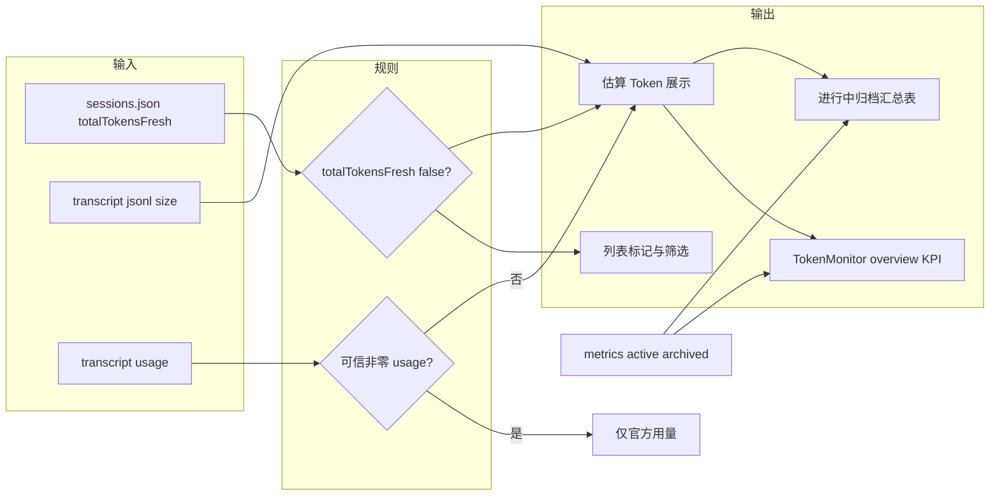

# OpenClaw TraceFlow PRD：索引不可信会话（totalTokensFresh=false）与基于日志大小的 Token 估算

| 属性 | 内容 |
|------|------|
| 产品 | OpenClaw TraceFlow（`openclaw-traceflow/`） |
| 状态 | 草案 |
| 日期 | 2026-03-23 |

## 1. 背景与问题

- **现象**：部分模型路由/云厂商在特定模式下**不回传或回传不可信**的 `usage`，OpenClaw 会在 `sessions.json` 中写入 **`totalTokensFresh: false`**，表示**索引里的 `totalTokens` 不宜作为「当前上下文窗口」占用依据**（与 [`openclaw-traceflow/src/common/session-token-context.ts`](../openclaw-traceflow/src/common/session-token-context.ts) 注释一致）。
- **用户痛点**：会话列表可能出现 **Token 为 0 / 利用率条不可信**（现有 UI 已用 `contextUtilizationReliable === false` 弱化进度条并加 `*`，见 [`Sessions.jsx`](../openclaw-traceflow/frontend/src/pages/Sessions.jsx)），但**没有显式说明「属于索引未刷新类」**，也难以**批量找出**这类会话。
- **产品目标**：在**不冒充官方计费**的前提下，用 **live transcript 文件大小**（已有 [`sessions.service` 列表字段 `transcriptFileSizeBytes`](../openclaw-traceflow/src/sessions/sessions.service.ts) 等）提供**可解释的估算用量**，辅助运维与容量感知。

## 2. 术语与触发条件（产品口径）

| 概念 | 含义 |
|------|------|
| **官方用量可信** | transcript 中存在非零 `usage` 且合并逻辑认为可对 `limit` 做利用率；或 `sessions.json` 中 `totalTokensFresh !== false` 且索引 total 被采用。 |
| **官方用量不可信（本需求核心）** | **`totalTokensFresh === false`**。 |
| **估算 Token** | 由 **`.jsonl` 字节数 × 启发式** 推算，**仅作参考**，不得与发票/账单混同。 |

**触发估算的推荐规则（可配置）：**

- **主条件**：`totalTokensFresh === false` **或** `contextUtilizationReliable === false`（与现有 UI 弱化逻辑对齐）。
- **次条件**：主条件成立且（`tokenUsage.total` 与 input+output 均为 0 **或** 明显与日志体量矛盾时）展示估算；若 transcript 已有可信非零 usage，则以官方为准，不覆盖。

## 3. 目标与非目标

### 目标

1. **会话列表**：对所有 **`totalTokensFresh === false`** 的会话**可识别、可筛选、可理解原因**（不仅依赖 `*`）。
2. **估算展示**：在列表（及详情摘要区）展示 **`estimatedTotalTokens`（估算）**，来源标注为 **「由日志文件大小推算」**。
3. **Token 监控 — 按 sessionKey 的汇总表（进行中 / 归档）**：与现有 [`TokenMonitor.jsx`](../openclaw-traceflow/frontend/src/pages/TokenMonitor.jsx) 中 **`token.tableActive` / `token.tableArchived`**（`metricsApi.getTokenUsageBySessionKeyPaged` 的 `activeTokens` / `archivedTokens`）对齐，**同一套**「官方 vs 估算」与「索引不可信」标记。
4. **Token 监控 — Overview**：在现有 KPI 行（会话数、阈值分布等）之上或扩展第二行，增加**总览指标**：不可信会话数、进行中/归档与估算量级、**24h（或面板时间窗）内 metrics 汇总 vs 估算**（双轨：**记录值** + **估算补充**）。
5. **诚实展示**：估算旁 **ℹ/Tooltip**；**overview 与两张汇总表**的区块级 ℹ 写明：metrics 来自采集快照、估算来自当前 live 日志大小，二者不同步属预期。

### 非目标

- 不承诺与任一云厂商控制台数字一致；**不作为计费依据**。
- 首版不做精确 tokenizer 级还原（可列二期）。

## 4. 功能需求

### 4.1 会话列表：枚举 totalTokensFresh=false

- **展示**：可见标记（标签「索引未刷新」、图标、或 Token 列旁二级文案）。
- **筛选**：**「用量索引不可信」**，仅 `totalTokensFresh === false`。
- **排序（可选）**：按 `transcriptFileSizeBytes` 或估算 Token。
- **API**：列表响应携带 **`tokenUsageMeta.totalTokensFresh`**（或 `staleTokenIndex`）。现状缺口：[`SessionsService.listSessions`](../openclaw-traceflow/src/sessions/sessions.service.ts) 未映射 `tokenUsageMeta`；[`session-storage`](../openclaw-traceflow/src/storage/session-storage.ts) 构建列表对象时需**透传** `sessions.json` 的 `totalTokensFresh`。

### 4.2 基于文件大小的 Token 估算

- **输入**：`transcriptFileSizeBytes`；详情可用 `sessionLogFileSizeBytes`。
- **公式**：`estimatedTokens = ceil(bytes / divisor)`，默认 `divisor = 4`，可配置（env/设置）。
- **展示**：官方 total（若有）+ **`≈ N（估算）`**；**不**用估算 total 冒充真实上下文利用率（若要做「粗参考条」须单独弱化条并独立文案）。
- **详情页**：与 [`SessionDetail.jsx`](../openclaw-traceflow/frontend/src/pages/SessionDetail.jsx) 中 `totalTokensFresh === false` 提示联动，增加「估算 Token（自日志大小）」。

### 4.3 Token 监控页：Overview（总览）

**位置**：[`TokenMonitor.jsx`](../openclaw-traceflow/frontend/src/pages/TokenMonitor.jsx) 现有 KPI 区域之上或第二行。

**建议 KPI（首版可子集）**

- **索引不可信会话数**（数据源：`GET /api/sessions`；分页场景需约定「当前已加载」或专用计数 API）。
- **交叉**：有 `activeTokens > 0` / 仅有 `archivedTokens > 0` 的不可信会话条数（与 `bySessionKey` 合并）。
- **估算合计（活跃）**：对不可信 sessionKey 用当前 `transcriptFileSizeBytes` 估算；注意性能（Top N 或全量）。
- **归档估算**：若首版不能 stat `.jsonl.reset.*`，overview **仅活跃估算 + 文案说明归档待二期**。
- **对照**：`sum(activeTokens)` / `sum(archivedTokens)`（分页聚合或 `summary` 端点）与 **估算合计** 并排，标签 **「记录值」** vs **「估算（日志大小）」**。

**i18n**：`token.overviewStaleCountDesc`、`token.overviewEstimatedVsRecordedDesc` 等；各 KPI 配 `SectionScopeHint`。

#### 4.3.1 消耗排行（Top N）数据口径

- **接口与字段**：前端「Token 消耗 Top N」使用 `GET /api/sessions/token-usage` 返回项中的 **`totalTokens`**（见 [`TokenMonitorService.getSessionTokenUsage`](../openclaw-traceflow/src/sessions/token-monitor.service.ts)）。
- **不含归档**：该值为**当前 live transcript 合并用量**，**不包含** 归档纪元（`*.jsonl.reset.*`）累计；**不等于** 同页下方「归档」汇总表中的 **`archivedTokens`** 排行或加总。
- **会话范围**：对 **`listSessions()` 返回的全部会话** 各算一条，**未**按「仅进行中」等业务状态过滤。
- **与双表关系**：「进行中 / 归档」两表数据来自 **metrics**（`getTokenUsageBySessionKey` / `activeTokens` · `archivedTokens`）；排行来自 **token-monitor** 路径——须在区块 ℹ / `token.chartTopRateDesc` 等文案中写清，避免与 metrics 表混读。

### 4.4 Token 监控页：汇总表（进行中 / 归档）

**现状**：左表 `activeTokens > 0`，右表 `archivedTokens > 0`（约 277–370 行）。

**增量**

- **行级合并**：`sessionKey` → `sessionList` 的 `tokenUsageMeta.totalTokensFresh`、`transcriptFileSizeBytes`。
- **列**：徽标「索引不可信」；保留 metrics **官方** `activeTokens`/`archivedTokens`；侧/次行 **`≈ 估算`**（归档行无单 epoch 大小时可「—」+ Tooltip）。
- **排序（可选）**：按「记录 vs 估算」差值。
- **区块说明**：更新 `token.tableActiveDesc` / `token.tableArchivedDesc`：进行中 = live 窗口 metrics；归档 = reset 纪元累加；估算含义与会话列表一致。

### 4.5 指标与采集（可选、二期）

- [`metrics.module.ts`](../openclaw-traceflow/src/metrics/metrics.module.ts) 可选写入 **`estimatedTokens`** / `estimatedFromLogBytes`（字段名带 `estimated`）。首版可仅前端合并 `sessionList + metrics`。

## 5. 交互与文案（要点）

- **i18n**：`sessions.staleTokenIndexBadge`、`sessions.estimatedTokensFromLogSize`、`sessions.estimatedTokensDisclaimer`；`token.overview*`、`token.estimatedFromLog*`、`token.tableActiveStaleHint`、`token.tableArchivedStaleHint`。中/英同步，见 [`openclaw-traceflow/CLAUDE.md`](../openclaw-traceflow/CLAUDE.md)。
- **Tooltip**：公式、仅估算、厂商缺 usage 常见为 0；监控页补充 **metrics 时刻 vs 当前文件** 可能不一致。

## 6. 验收标准（AC）

1. `totalTokensFresh: false` 会话：列表**明确标记**，筛选**仅**此类。
2. `transcriptFileSizeBytes` 变化时估算**单调**（同 divisor）。
3. 可信非零 usage：**不**用估算覆盖官方 total。
4. Token 监控双表：**至少一行**不可信会话同时 **metrics 列 + 估算列**，divisor/Tooltip 与会话列表一致。
5. Token 监控 overview：**不可信会话数** + **记录值合计 vs 估算合计（活跃）** 之一组对照 + ℹ。
6. 文案无「计费/准确」暗示；英文 *estimate / heuristic*。
7. Token 监控「消耗排行」：`token.chartTopRateDesc`（或等价 ℹ）写清 **live 合并用量、不含归档、listSessions 全量、与 metrics 双表不同**（见 4.3.1）。

## 7. 实现落点（索引）

| 层级 | 路径 |
|------|------|
| 存储/列表 | `openclaw-traceflow/src/storage/session-storage.ts` |
| API | `openclaw-traceflow/src/sessions/sessions.service.ts` |
| 估算逻辑 | 建议独立纯函数 + 单测 |
| Metrics（可选） | `openclaw-traceflow/src/metrics/metrics.service.ts`、`.controller.ts` |
| 前端 | `openclaw-traceflow/frontend/src/pages/Sessions.jsx`、`TokenMonitor.jsx` |
| 文案 | `openclaw-traceflow/frontend/src/locales/zh-CN.js`、`en-US.js` |

## 8. 开放问题

- `divisor` 固定 4 还是按 `model` 配置（与 pricing 解耦）。
- 首版是否**不做**估算利用率进度条（推荐不做）。
- 归档估算：首版仅 live + 声明不含 `.reset.*`，或二期 stat 归档文件。

## 9. 数据流（示意）

## 10. 研发任务清单（与实现跟踪）

- [ ] 列表 API 透传 `totalTokensFresh` / `tokenUsageMeta`，session-storage 挂载
- [ ] `bytes → estimatedTokens` 纯函数 + 可配置 divisor + 单测
- [ ] Sessions 列表：标记、筛选、估算、i18n
- [ ] TokenMonitor：overview KPI + 双表合并展示
- [ ] SessionDetail 联动；metrics 入库 estimated（可选二期）
